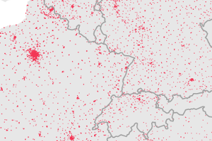
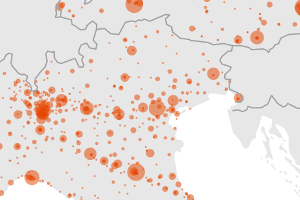

# Healthcare services in Europe

Geospatial datasets on main healthcare services in European countries, published by [Eurostat](https://ec.europa.eu/eurostat/).

For more information, **see [this page](https://ec.europa.eu/eurostat/web/gisco/geodata/reference-data/healthcare-services)**, the [metadata document](https://github.com/eurostat/healthcare-services/blob/master/data/metadata.pdf) and the [overview map](https://eurostat.github.io/healthcare-services/map/healthcare/).

 
